# 🌾 AgroGyaan Backend-AI

<div align="center">


**AI-Powered Agricultural Knowledge Assistant Backend**

[Features](#-features) • [Tech Stack](#-tech-stack) • [Architecture](#-high-level-system-architecture) • [API Docs](#-api-documentation) • [Getting Started](#-how-to-run-locally)

</div>

---

## 1. 📋 Project Overview

### Project Name
**AgroGyaan Backend-AI** — Intelligent Agricultural Assistant Backend

### Description
AgroGyaan Backend-AI is a production-ready, AI-powered backend system designed to provide Indian farmers and agricultural stakeholders with intelligent, context-aware farming advice. The system leverages state-of-the-art Large Language Models (LLMs), computer vision, and machine learning to deliver personalized agricultural recommendations.

### Problem It Solves
- **Information Gap**: Bridges the knowledge divide between agricultural research and farmers
- **Language Barriers**: Supports 12+ regional Indian languages via text-to-speech
- **Real-time Insights**: Provides location-aware, weather-integrated crop recommendations
- **Disease Detection**: Enables instant crop disease identification through image analysis
- **Market Intelligence**: Offers real-time commodity prices from government sources
- **Accessibility**: Delivers audio responses for farmers with limited literacy

### Target Users
| User Type | Description |
|-----------|-------------|
| **Farmers** | Primary users seeking crop advice, disease diagnosis, and market prices |
| **Agricultural Officers** | Government officials needing data-driven insights |
| **Agronomists** | Professionals requiring scientific farming recommendations |
| **Agri-Tech Developers** | Developers integrating agricultural AI into applications |
| **Rural Extension Workers** | Field workers delivering farming advice to remote areas |

---

## 2. ✨ Features

### 🌱 User Features

| Feature | Description |
|---------|-------------|
| **AI Chat Assistant** | Natural language conversations about farming, crops, and agriculture |
| **Image-Based Disease Detection** | Upload crop images for AI-powered disease diagnosis |
| **Multi-Language TTS** | Audio responses in 12 languages (Hindi, Tamil, Telugu, Bengali, etc.) |
| **Market Price Lookup** | Real-time commodity prices filtered by state, district, and crop |
| **Organic Farming Guides** | Location-specific organic cultivation recommendations |
| **Crop Recommendations** | ML-powered crop suggestions based on soil and weather data |
| **Weather Integration** | Live weather data for location-aware farming advice |
| **Seasonal Alerts** | Automatic notifications based on agricultural seasons |

### ⚙️ Admin/System Features

| Feature | Description |
|---------|-------------|
| **Health Monitoring** | Comprehensive `/health` endpoint with component status |
| **Prometheus Metrics** | Real-time performance metrics at `/metrics` |
| **System Statistics** | Vector store stats, memory usage, and cache analytics |
| **Rate Limiting** | API throttling for Groq (100/min), Gemini (60/min), Weather (60/min) |
| **Background Tasks** | Automated cache cleanup and health monitoring threads |
| **Structured Logging** | Production-grade logging with timestamps and levels |

### 🔐 Security & Performance Features

| Feature | Implementation |
|---------|----------------|
| **Input Validation** | Pydantic models for all request/response schemas |
| **CORS Protection** | Configurable cross-origin resource sharing |
| **File Upload Security** | Image format validation and size limits (5MB) |
| **Response Caching** | 24-hour intelligent cache with MD5 hashing |
| **Model Fallback** | Groq → Gemini automatic failover for 99.9% availability |
| **Rate Limiting** | Thread-safe rate limiters for all external APIs |

---

## 3. 🛠️ Tech Stack

| Layer | Technology | Purpose |
|-------|------------|---------|
| **Backend Framework** | FastAPI 0.110.0 | Async REST API with automatic OpenAPI docs |
| **Language** | Python 3.8+ | Core programming language |
| **LLM (Primary)** | Groq Llama 3.1-8b-instant | Fast text-based chat responses |
| **LLM (Fallback)** | Google Gemini 2.5 Pro | Complex queries and image analysis |
| **Vector Database** | Pinecone | Semantic document search (RAG) |
| **Embeddings** | Google text-embedding-004 | Document vectorization |
| **ML Model** | Scikit-learn OneVsRestClassifier | Crop recommendation predictions |
| **Text-to-Speech** | gTTS | Multi-language audio generation |
| **Weather API** | OpenWeatherMap | Real-time weather data |
| **Location API** | Geoapify | IP-based geolocation |
| **Market Data API** | data.gov.in | Indian agricultural commodity prices |
| **Caching** | In-memory + LRU | Response and audio caching |
| **Monitoring** | Prometheus Client | Metrics collection and monitoring |
| **Server** | Uvicorn | ASGI server for production |
| **Deployment** | Render | Cloud hosting platform |

---

## 4. 🏗️ High-Level System Architecture

### Overall Architecture

The AgroGyaan Backend-AI follows a **modular, layered architecture** with clear separation of concerns:

```
┌─────────────────────────────────────────────────────────────────────────────┐
│                              CLIENT LAYER                                    │
│                   (Mobile Apps / Web Frontend / Third-party)                 │
└─────────────────────────────────────────────────────────────────────────────┘
                                      │
                                      ▼
┌─────────────────────────────────────────────────────────────────────────────┐
│                             API GATEWAY LAYER                                │
│                    FastAPI + CORS + Rate Limiting + Auth                     │
└─────────────────────────────────────────────────────────────────────────────┘
                                      │
          ┌───────────────────────────┼───────────────────────────┐
          ▼                           ▼                           ▼
┌─────────────────┐       ┌─────────────────────┐       ┌─────────────────┐
│  Chat Router    │       │  Crop Prediction    │       │  Market Router  │
│  /api/chat      │       │  /api/predict       │       │  /api/market    │
└─────────────────┘       └─────────────────────┘       └─────────────────┘
          │                           │                           │
          ▼                           ▼                           ▼
┌─────────────────────────────────────────────────────────────────────────────┐
│                            SERVICE LAYER                                     │
│      Chat Service │ CropRecommendation │ FarmingGuide │ ImageProcessor       │
└─────────────────────────────────────────────────────────────────────────────┘
          │                           │                           │
          ▼                           ▼                           ▼
┌─────────────────────────────────────────────────────────────────────────────┐
│                         EXTERNAL SERVICES LAYER                              │
│   Pinecone │ Groq │ Gemini │ OpenWeatherMap │ Geoapify │ data.gov.in         │
└─────────────────────────────────────────────────────────────────────────────┘
```

### Request Lifecycle

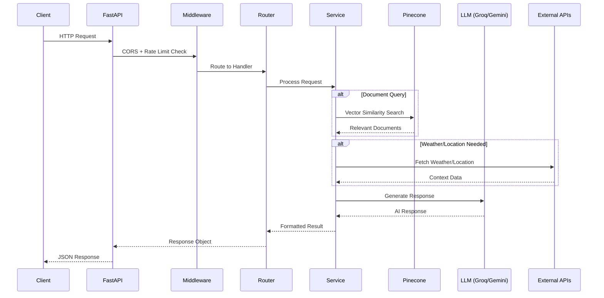

### Client → Backend → Database → External APIs Flow

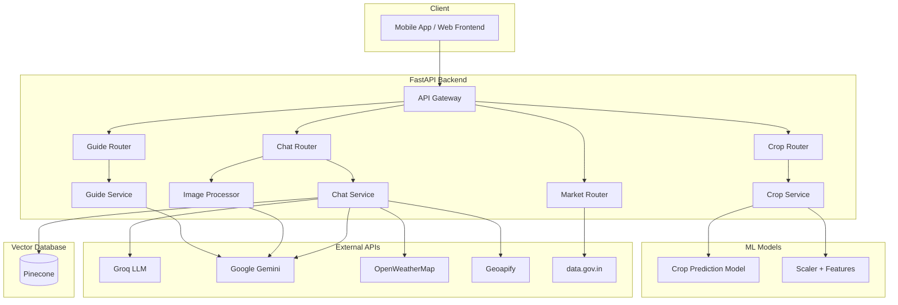

---

## 5. 🗄️ Database Architecture

### Vector Database (Pinecone)

AgroGyaan uses **Pinecone** as the primary vector database for semantic document retrieval.

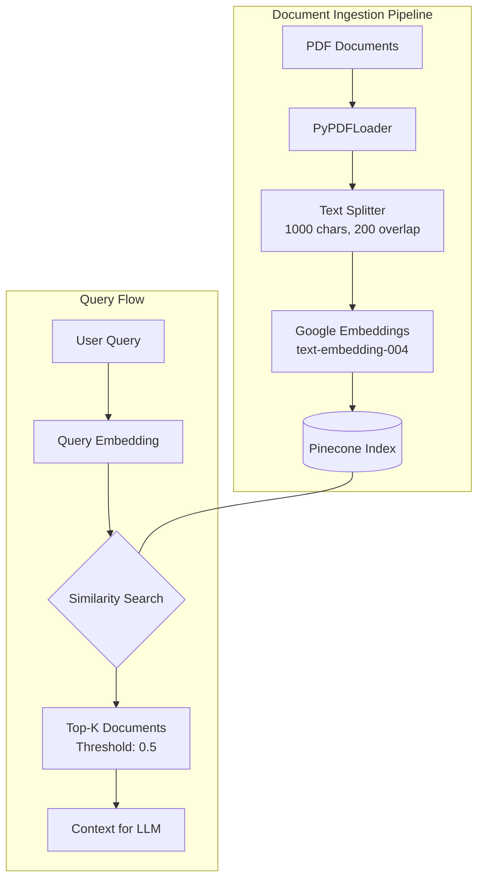

#### Pinecone Index Configuration

| Parameter | Value | Description |
|-----------|-------|-------------|
| **Index Name** | `agro-assistant-index` | Primary vector index |
| **Embedding Model** | `text-embedding-004` | 768-dimensional vectors |
| **Similarity Metric** | Cosine | Similarity threshold: 0.5 |
| **Document Chunk Size** | 1000 characters | Optimized for context |
| **Chunk Overlap** | 200 characters | Maintains continuity |

#### Document Storage

| Document Type | Count | Purpose |
|---------------|-------|---------|
| Agricultural Books | 8 | Comprehensive farming knowledge |
| Soil Science | 2 | Soil health and management |
| Plant Protection | 2 | Pest and disease management |
| Climate Agriculture | 1 | Climate-smart practices |
| Regional Guides | 2 | Location-specific advice |

### Cache Architecture

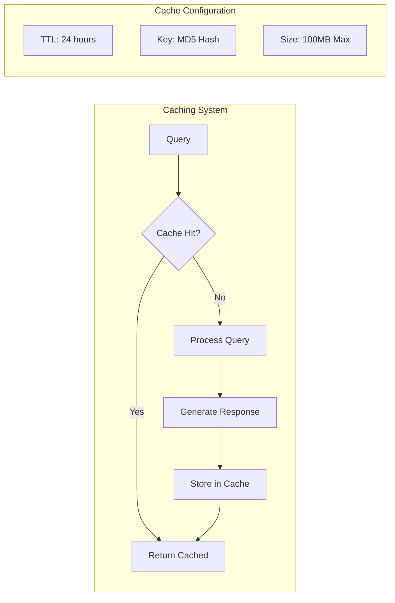

### ML Model Storage

| File | Purpose | Location |
|------|---------|----------|
| `optimized_crop_model.pkl` | Trained classifier | `Model/Crop_Recommendation/` |
| `scaler.pkl` | Feature scaler | `Model/Crop_Recommendation/` |
| `feature_names.pkl` | Input feature names | `Model/Crop_Recommendation/` |
| `crop_labels.pkl` | Output crop labels | `Model/Crop_Recommendation/` |
| `best_params.pkl` | Optimized hyperparameters | `Model/Crop_Recommendation/` |

---

## 6. 📚 API Documentation

### Base URLs

| Environment | URL |
|-------------|-----|
| **Local Development** | `http://localhost:8000` |
| **Production** | `https://agrogyaan-b-ai.onrender.com` |
| **API Documentation** | `{BASE_URL}/docs` |
| **ReDoc** | `{BASE_URL}/redoc` |

---

### 6.1 Chat Endpoints

#### POST `/api/chat`
**Description**: Process text-based agricultural queries with RAG-enhanced responses.

| Field | Value |
|-------|-------|
| **Method** | `POST` |
| **URL** | `/api/chat` |
| **Authentication** | No |
| **Rate Limit** | 100 requests/minute |

**Headers**:
```http
Content-Type: application/json
```

**Request Body**:
```json
{
  "query": "What crops should I plant in winter season?",
  "user_location": {
    "latitude": 28.6139,
    "longitude": 77.2090,
    "city": "Delhi",
    "state": "Delhi"
  }
}
```

**Success Response (200 OK)**:
```json
{
  "query": "What crops should I plant in winter season?",
  "answer": "For winter season (Rabi), consider planting wheat, barley, mustard, peas, and chickpeas...",
  "llm_source": "Groq (Llama 3.1)",
  "sources": ["Document: farming_guide.pdf (Page 15)"],
  "weather": {
    "location": "Delhi",
    "temperature": 22,
    "conditions": "clear sky",
    "humidity": 45
  },
  "location": {
    "city": "Delhi",
    "state": "Delhi",
    "country": "India"
  },
  "season": {
    "current_season": "Winter (Rabi Season)",
    "description": "Cold and dry season, suitable for wheat, barley, peas, and mustard"
  },
  "agricultural_alerts": ["Winter season: Protect crops from frost and cold waves"],
  "crop_suggestions": ["Wheat", "Barley", "Mustard", "Peas", "Chickpeas"],
  "analysis_type": "Text Analysis",
  "documents_used": 3,
  "context_used": true,
  "audio_available": false
}
```

**Error Responses**:

| Status | Error | Description |
|--------|-------|-------------|
| 400 | Bad Request | Invalid query format |
| 500 | Internal Server Error | LLM or processing failure |
| 503 | Service Unavailable | External API failure |

---

#### POST `/api/chat-with-image`
**Description**: Analyze crop images for disease detection with AI-powered insights.

| Field | Value |
|-------|-------|
| **Method** | `POST` |
| **URL** | `/api/chat-with-image` |
| **Authentication** | No |
| **Content-Type** | `multipart/form-data` |
| **Max Image Size** | 5MB |

**Headers**:
```http
Content-Type: multipart/form-data
```

**Request Body**:
```
query: "What disease does this plant have?"
image: <binary image data>
user_location: {"latitude": 28.61, "longitude": 77.20}
```

**Success Response (200 OK)**:
```json
{
  "query": "What disease does this plant have?",
  "answer": "Based on the image analysis, your rice plant shows symptoms of bacterial leaf blight...",
  "llm_source": "Gemini-2.5-pro (Image Analysis)",
  "sources": ["Image Analysis", "Document: plant_protection.pdf"],
  "weather": {...},
  "location": {...},
  "season": {...},
  "agricultural_alerts": ["High humidity: Monitor for fungal diseases"],
  "crop_suggestions": ["Use copper-based fungicides", "Improve drainage"],
  "analysis_type": "Image + Text Analysis",
  "documents_used": 2,
  "context_used": true,
  "audio_available": false
}
```

**Error Responses**:

| Status | Error | Description |
|--------|-------|-------------|
| 400 | Bad Request | No image provided or invalid format |
| 415 | Unsupported Media Type | Invalid image format (not JPG/PNG/WebP) |
| 413 | Payload Too Large | Image exceeds 5MB limit |
| 500 | Internal Server Error | Image processing failure |

---

#### POST `/api/generate-audio`
**Description**: Convert text to speech in multiple languages.

| Field | Value |
|-------|-------|
| **Method** | `POST` |
| **URL** | `/api/generate-audio` |
| **Authentication** | No |

**Request Body**:
```json
{
  "text": "Today's farming advice: Water your crops early morning.",
  "language": "hi"
}
```

**Supported Languages**:
| Code | Language | Code | Language |
|------|----------|------|----------|
| `en` | English | `bn` | Bengali |
| `hi` | Hindi | `ta` | Tamil |
| `te` | Telugu | `mr` | Marathi |
| `gu` | Gujarati | `kn` | Kannada |
| `ml` | Malayalam | `pa` | Punjabi |
| `es` | Spanish | `fr` | French |

**Success Response (200 OK)**:
```json
{
  "audio_data": "<base64-encoded-mp3>",
  "audio_format": "audio/mp3",
  "audio_language": "hi",
  "text_length": 52,
  "status": "success"
}
```

---

#### GET `/api/supported-languages`
**Description**: Get list of supported TTS languages.

**Response**:
```json
{
  "status": "success",
  "languages": {
    "en": "English",
    "hi": "Hindi",
    "ta": "Tamil"
  },
  "count": 12
}
```

---

### 6.2 Crop Recommendation Endpoints

#### POST `/api/predict`
**Description**: Predict optimal crop based on soil and weather parameters.

**Request Body**:
```json
{
  "N": 90,
  "P": 42,
  "K": 43,
  "temperature": 20.88,
  "humidity": 82.0,
  "ph": 6.5,
  "rainfall": 202.94
}
```

**Success Response (200 OK)**:
```json
{
  "predicted_crop": "rice",
  "confidence": 0.92,
  "recommendation_level": "HIGH_CONFIDENCE",
  "recommendations": [
    {"crop": "rice", "confidence": 0.92, "suitability": "SUITABLE"},
    {"crop": "maize", "confidence": 0.65, "suitability": "SUITABLE"},
    {"crop": "jute", "confidence": 0.43, "suitability": "MODERATELY_SUITABLE"}
  ],
  "model_type": "OneVsRestClassifier with GridSearchCV",
  "model_parameters": {"estimator__C": 1.0, "estimator__max_iter": 1000}
}
```

---

#### GET `/api/crops`
**Description**: Get list of all crops the model can predict.

**Response**:
```json
["rice", "maize", "chickpea", "kidneybeans", "pigeonpeas", "mothbeans", ...]
```

---

#### GET `/api/features`
**Description**: Get input feature information with descriptions.

**Response**:
```json
{
  "features": ["N", "P", "K", "temperature", "humidity", "ph", "rainfall"],
  "description": {
    "N": "Nitrogen content in soil (kg/ha)",
    "P": "Phosphorus content in soil (kg/ha)",
    "K": "Potassium content in soil (kg/ha)",
    "temperature": "Temperature in Celsius (°C)",
    "humidity": "Relative humidity percentage (%)",
    "ph": "Soil pH level (0-14 scale)",
    "rainfall": "Rainfall in millimeters (mm)"
  }
}
```

---

### 6.3 Market Price Endpoints

#### GET `/api/market-price`
**Description**: Fetch real-time agricultural commodity prices from data.gov.in.

**Query Parameters**:
| Parameter | Type | Required | Description |
|-----------|------|----------|-------------|
| `state` | string | Yes | State name (e.g., "Maharashtra") |
| `district` | string | No | District name |
| `commodity` | string | No | Commodity name (e.g., "Rice") |
| `arrival_date` | string | No | Date in DD/MM/YYYY format |

**Example Request**:
```http
GET /api/market-price?state=Maharashtra&district=Mumbai&commodity=Rice
```

**Success Response (200 OK)**:
```json
{
  "used_date": "28/01/2026",
  "data": {
    "records": [
      {
        "State": "Maharashtra",
        "District": "Mumbai",
        "Commodity": "Rice",
        "Variety": "Basmati",
        "Min_Price": 2500,
        "Max_Price": 3000,
        "Modal_Price": 2750,
        "Arrival_Date": "28/01/2026"
      }
    ]
  }
}
```

---

### 6.4 Organic Farming Guide Endpoints

#### GET `/guide-region`
**Description**: Get organic farming principles for a specific location.

**Query Parameters**:
| Parameter | Type | Required | Description |
|-----------|------|----------|-------------|
| `location` | string | Yes | Location name (e.g., "Punjab") |

**Success Response**:
```json
{
  "location": "Punjab",
  "guide": [
    {
      "icon": "🌱",
      "title": "Soil Health Management",
      "description": "Build organic matter through composting..."
    },
    {
      "icon": "🔄",
      "title": "Crop Rotation",
      "description": "Rotate crops to prevent soil depletion..."
    }
  ]
}
```

---

#### GET `/guide-crop`
**Description**: Get organic farming guide for a specific crop in a location.

**Query Parameters**:
| Parameter | Type | Required | Description |
|-----------|------|----------|-------------|
| `location` | string | Yes | Location name |
| `crop` | string | Yes | Crop name |

**Success Response**:
```json
{
  "location": "Punjab",
  "crop": "Tomatoes",
  "guide": {
    "name": "Tomatoes",
    "difficulty": "Intermediate",
    "timeToHarvest": "70-80 days",
    "spacing": "18-24 inches apart",
    "practices": {
      "planting": {
        "title": "Planting",
        "tips": ["Start seeds indoors 6-8 weeks before last frost"]
      },
      "soil": {
        "title": "Soil Preparation",
        "tips": ["Well-draining soil with pH 6.0-6.8"]
      },
      "care": {
        "title": "Organic Care",
        "tips": ["Mulch around plants to retain moisture"]
      },
      "pest": {
        "title": "Natural Pest Control",
        "tips": ["Use beneficial insects like ladybugs"]
      }
    }
  }
}
```

---

### 6.5 Health & Monitoring Endpoints

#### GET `/health`
**Description**: Comprehensive system health check.

**Success Response**:
```json
{
  "status": "healthy",
  "service": "AI Farming Assistant API",
  "version": "2.0.0",
  "image_processor": {
    "initialized": true,
    "gemini_available": true
  },
  "endpoints_available": [
    "GET /",
    "GET /health",
    "POST /api/chat",
    "POST /api/chat-with-image"
  ]
}
```

---

## 7. 🔄 Complete API Flow

### Step-by-Step Request Lifecycle

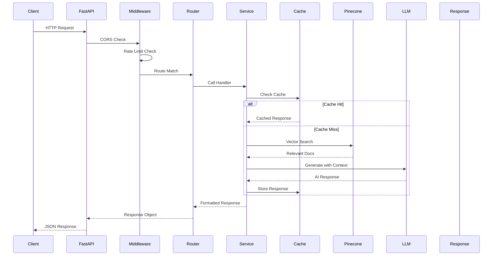

### Middleware Flow

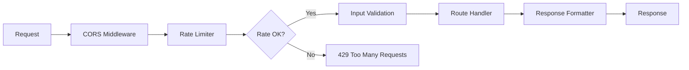

### Validation → Controller → Service → Database → Response

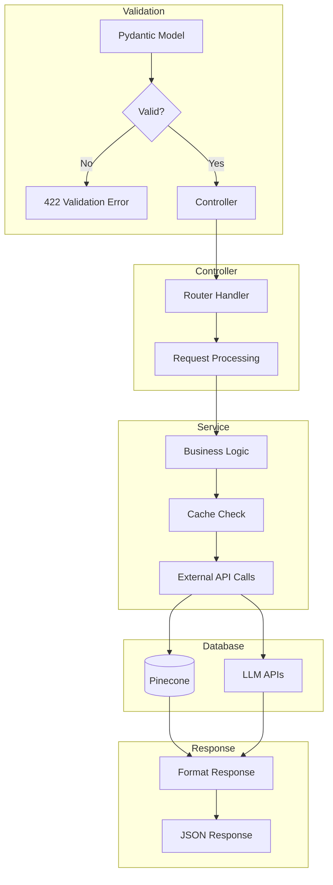

---

## 8. 💬 Chat Flow Architecture

### Message Lifecycle

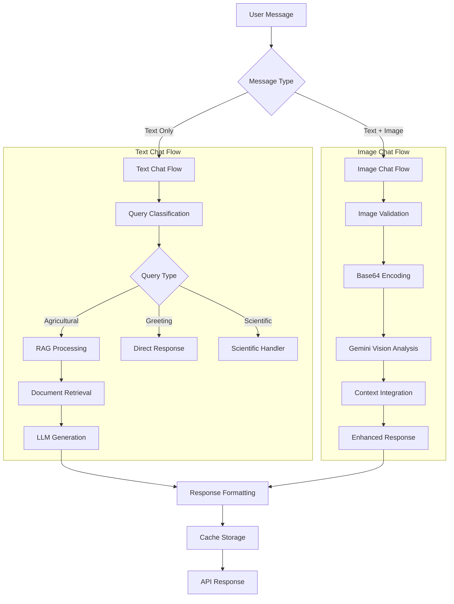

### Real-time vs REST Explanation

| Aspect | Current Implementation | Alternative |
|--------|----------------------|-------------|
| **Protocol** | REST/HTTP | WebSocket (Future) |
| **Communication** | Request-Response | Full Duplex |
| **Use Case** | Stateless queries | Real-time chat |
| **Latency** | Per-request overhead | Persistent connection |

> **Note**: The current system uses **REST APIs** for simplicity and scalability. For real-time chat requirements, WebSocket support can be added as a future enhancement.

### Request Processing Logic

```python
# Simplified processing flow
def process_query(query, user_location):
    # 1. Check cache
    cache_key = generate_hash(query, user_location)
    if cached := get_from_cache(cache_key):
        return cached
    
    # 2. Classify query
    if is_greeting(query):
        return handle_greeting()
    if is_scientific_query(query):
        return handle_scientific_query(query)
    
    # 3. Get context
    location = get_location(user_location)
    weather = get_weather(location)
    season = determine_season()
    
    # 4. Retrieve documents
    documents = pinecone_search(query)
    
    # 5. Generate response
    response = generate_with_llm(query, documents, context)
    
    # 6. Cache and return
    store_in_cache(cache_key, response)
    return response
```

### Audio Generation Flow

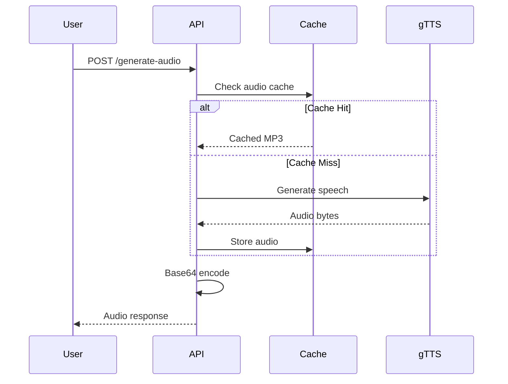

---

## 9. 👤 User Flow

### Signup → Login → Core Features → Logout

> **Note**: Authentication is handled by the main AgroGyaan application. The Backend-AI operates as a stateless service layer.

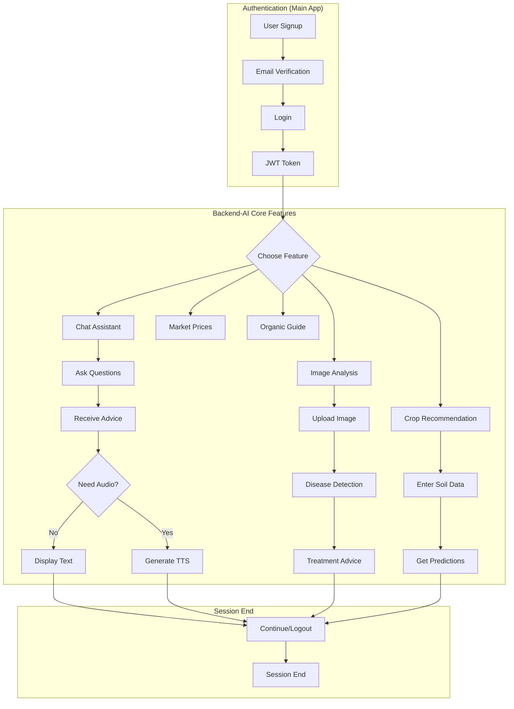

### Role-Based Access

| Role | Accessible Features | Restrictions |
|------|--------------------|--------------| 
| **Guest** | Public endpoints, docs | No personalized features |
| **User** | All chat, image analysis | Standard rate limits |
| **Premium** | Priority processing | Higher rate limits |
| **Admin** | Health/metrics endpoints | System monitoring |

### Error and Edge Cases

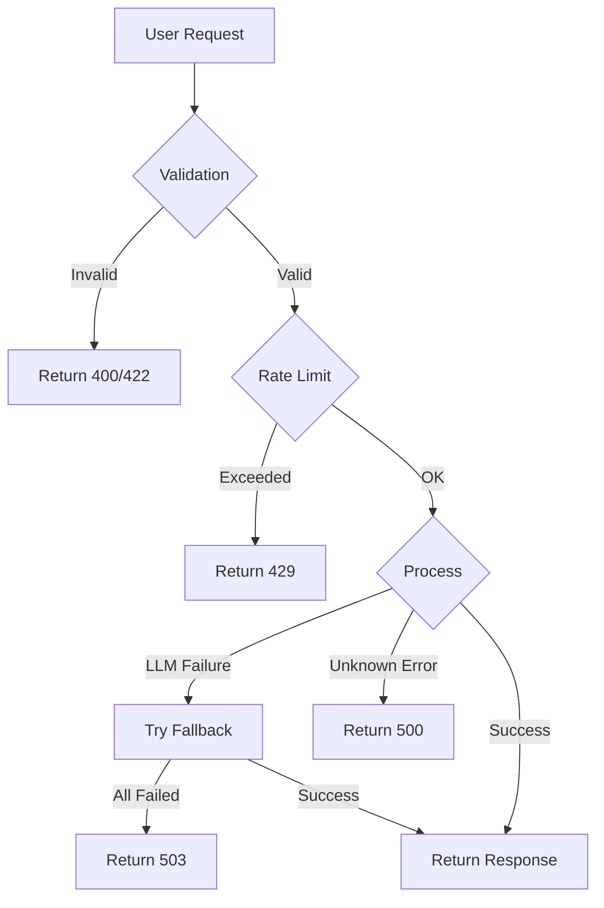

---

## 10. 🔐 Authentication & Authorization

### Auth Strategy

The Backend-AI operates as a **stateless service** integrated with the main AgroGyaan authentication system.

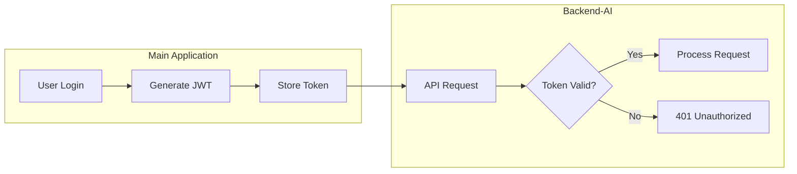

### Token Lifecycle

| Stage | Description | Duration |
|-------|-------------|----------|
| **Generation** | On successful login | Immediate |
| **Access Token** | Short-lived auth token | 1 hour |
| **Refresh Token** | Long-lived renewal token | 7 days |
| **Expiration** | Automatic invalidation | On logout/timeout |

### Role-Based Access Control (RBAC)

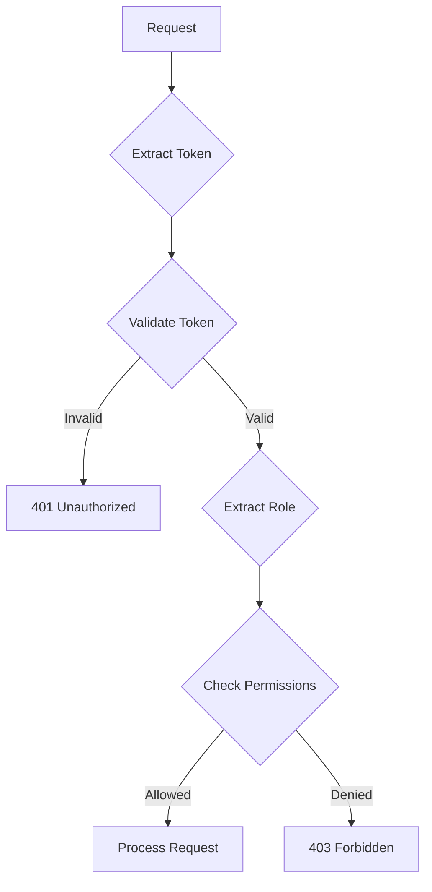

---

## 11. 🔧 Environment Variables

Create a `.env` file in the project root with the following variables:

| Variable | Description | Required | Example |
|----------|-------------|----------|---------|
| `PINECONE_API_KEY` | Pinecone vector database API key | ✅ Yes | `pc-xxxxxxxxxxxxxxxx` |
| `GOOGLE_API_KEY` | Google AI/Gemini API key | ✅ Yes | `AIzaSyxxxxxxxxxxxxxx` |
| `GROQ_API_KEY` | Groq LLM API key | ✅ Yes | `gsk_xxxxxxxxxxxxxxxx` |
| `GEOAPIFY_API_KEY` | Geoapify location API key | ✅ Yes | `xxxxxxxxxxxxxxxx` |
| `OPENWEATHER_API_KEY` | OpenWeatherMap API key | ✅ Yes | `xxxxxxxxxxxxxxxx` |

### Example `.env` file:
```bash
# LLM API Keys
PINECONE_API_KEY=your_pinecone_api_key_here
GOOGLE_API_KEY=your_google_api_key_here  
GROQ_API_KEY=your_groq_api_key_here

# External Service Keys
GEOAPIFY_API_KEY=your_geoapify_api_key_here
OPENWEATHER_API_KEY=your_openweather_api_key_here
```

---

## 12. 🚀 How to Run Locally

### Step-by-Step Setup

#### 1. Clone the Repository
```bash
git clone https://github.com/your-org/AgroGyaan.git
cd AgroGyaan/Backend-AI
```

#### 2. Create Virtual Environment
```bash
# Windows
python -m venv venv
venv\Scripts\activate

# macOS/Linux
python3 -m venv venv
source venv/bin/activate
```

#### 3. Install Dependencies
```bash
pip install -r requirements.txt
```

#### 4. Configure Environment Variables
```bash
# Copy example env file
cp .env.example .env

# Edit .env with your API keys
# Use any text editor to add your keys
```

#### 5. Database Setup (Pinecone)
1. Create a Pinecone account at [pinecone.io](https://www.pinecone.io/)
2. Create an index named `agro-assistant-index`
3. Set dimension to `768` (for text-embedding-004)
4. Add your API key to `.env`

#### 6. Prepare ML Models
Ensure the following files exist in `../Model/Crop_Recommendation/`:
- `optimized_crop_model.pkl`
- `scaler.pkl`
- `feature_names.pkl`
- `crop_labels.pkl`
- `best_params.pkl`

#### 7. Start the Server
```bash
python main.py
```

The API will be available at `http://localhost:8000`

---

## 13. 🖥️ How to Start the Server

### Development Mode
```bash
# Simple development server
python main.py

# With auto-reload
uvicorn main:app --reload --host 0.0.0.0 --port 8000
```

### Production Mode
```bash
# Production with multiple workers
uvicorn main:app --host 0.0.0.0 --port 8000 --workers 4

# With gunicorn (recommended for production)
gunicorn main:app -w 4 -k uvicorn.workers.UvicornWorker --bind 0.0.0.0:8000
```

### Docker
```bash
# Build image
docker build -t agrogyaan-backend .

# Run container
docker run -d -p 8000:8000 --env-file .env agrogyaan-backend
```

**Dockerfile**:
```dockerfile
FROM python:3.9-slim

WORKDIR /app

COPY requirements.txt .
RUN pip install --no-cache-dir -r requirements.txt

COPY . .

EXPOSE 8000

CMD ["uvicorn", "main:app", "--host", "0.0.0.0", "--port", "8000"]
```

---

## 14. ☁️ Deployment Guide

### Hosting Platform: Render

The production deployment is hosted on **Render** at:
```
https://agrogyaan-b-ai.onrender.com
```

### Build Steps

1. **Connect Repository**
   - Link GitHub repository to Render
   - Select the `Backend-AI` directory

2. **Configure Build**
   ```yaml
   Build Command: pip install -r requirements.txt
   Start Command: uvicorn main:app --host 0.0.0.0 --port $PORT
   ```

3. **Set Environment Variables**
   - Add all required API keys in Render dashboard
   - Enable auto-deploy on push

### Environment Setup on Render

| Setting | Value |
|---------|-------|
| **Python Version** | 3.9 |
| **Build Command** | `pip install -r requirements.txt` |
| **Start Command** | `uvicorn main:app --host 0.0.0.0 --port $PORT` |
| **Region** | Oregon (US West) or Mumbai (Asia) |

### CI/CD Overview

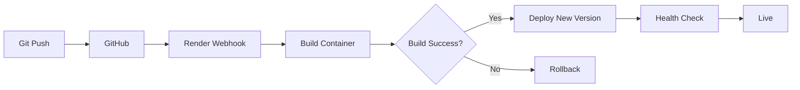

---

## 15. 📁 Folder Structure

```
Backend-AI/
├── main.py                          # FastAPI application entry point
├── requirements.txt                 # Python dependencies
├── .env                             # Environment variables (gitignored)
├── .env.example                     # Environment template
├── .gitignore                       # Git ignore patterns
├── README.md                        # This file
├── agro_assistant.log               # Application logs (gitignored)
│
├── routes/                          # API route handlers
│   ├── __init__.py                  # Routes package init
│   ├── crop_recommendation_router.py  # Crop prediction endpoints
│   ├── marketprice_router.py        # Market price endpoints
│   ├── organicguide_router.py       # Organic guide endpoints
│   │
│   └── main_chatbot/                # Core chat functionality
│       ├── __init__.py              # Chatbot package init
│       ├── chat.py                  # Main chat logic (2888 lines)
│       ├── chat_router.py           # Chat API endpoints
│       ├── image_processor.py       # Gemini Vision processing
│       │
│       ├── cache/                   # Response cache storage
│       │
│       └── data/                    # PDF knowledge base
│           ├── agri.pdf             # Agricultural textbook
│           ├── farmerbook.pdf       # Farmer's guide
│           ├── agronomy-book.pdf    # Agronomy reference
│           ├── Introduction-to-Soil-Science.pdf
│           ├── Plant_Protection_Code.pdf
│           └── ... (15 PDF files total)
│
├── services/                        # Business logic services
│   ├── Crop_Recommendation/
│   │   └── crop_service.py          # ML prediction service
│   │
│   └── Farming_Guide/
│       └── guide.py                 # Gemini guide generation
│
└── __pycache__/                     # Python bytecode (gitignored)
```

### Folder Descriptions

| Folder/File | Purpose |
|-------------|---------|
| `main.py` | FastAPI app initialization, router registration, health endpoints |
| `routes/` | All API endpoint handlers organized by feature |
| `routes/main_chatbot/` | Core chat functionality with RAG and image processing |
| `routes/main_chatbot/data/` | PDF documents for knowledge base (vectorized in Pinecone) |
| `routes/main_chatbot/cache/` | File-based response cache |
| `services/` | Business logic separated from routes |
| `services/Crop_Recommendation/` | ML model loading and prediction |
| `services/Farming_Guide/` | Organic farming guide generation |

---

## 16. ⚠️ Error Handling & Logging

### Global Error Handling

```python
# Exception handlers in FastAPI
@app.exception_handler(HTTPException)
async def http_exception_handler(request, exc):
    return JSONResponse(
        status_code=exc.status_code,
        content={"error": exc.detail, "status_code": exc.status_code}
    )

@app.exception_handler(Exception)
async def general_exception_handler(request, exc):
    logger.error(f"Unhandled exception: {str(exc)}")
    return JSONResponse(
        status_code=500,
        content={"error": "Internal server error", "status_code": 500}
    )
```

### Error Response Format

```json
{
  "error": "Detailed error message",
  "status_code": 500,
  "timestamp": "2026-01-28T23:30:00Z"
}
```

### Logging Strategy

| Log Level | Usage |
|-----------|-------|
| `DEBUG` | Detailed debugging information |
| `INFO` | Request processing, cache hits/misses |
| `WARNING` | Recoverable errors, fallback activations |
| `ERROR` | Failed operations, external API errors |
| `CRITICAL` | System failures, unrecoverable errors |

### Log Format
```
2026-01-28 23:30:00,123 - INFO - Processing query: What crops to plant?
2026-01-28 23:30:01,456 - INFO - LLM response generated in 1.33s
2026-01-28 23:30:02,789 - ERROR - Groq API error: Rate limit exceeded
```

### Monitoring (Prometheus Metrics)

| Metric | Type | Description |
|--------|------|-------------|
| `agro_assistant_queries_total` | Counter | Total queries by LLM source |
| `agro_assistant_query_duration_seconds` | Histogram | Query processing time |
| `agro_assistant_active_queries` | Gauge | Concurrent queries |
| `agro_assistant_cache_hits_total` | Counter | Cache hit count |
| `agro_assistant_api_errors_total` | Counter | External API errors |

---

## 17. 🛡️ Security Best Practices

### Input Validation

| Validation | Implementation |
|------------|----------------|
| **Request Schema** | Pydantic models with type hints |
| **Query Length** | Max 5000 characters for text |
| **File Upload** | Type check, size limit (5MB) |
| **Language Code** | Whitelist of supported codes |

### Rate Limiting

| API | Rate Limit | Window |
|-----|------------|--------|
| Groq LLM | 100 requests | 1 minute |
| Gemini | 60 requests | 1 minute |
| Weather API | 60 requests | 1 minute |

### Authentication Protection

- CORS middleware with configurable origins
- No sensitive data in error messages
- Request logging without secrets

### Data Encryption

| Layer | Protection |
|-------|------------|
| **Transport** | HTTPS (TLS 1.2+) |
| **Storage** | Environment variables in secure vault |
| **API Keys** | Never logged or exposed |

---

## 18. 🗺️ Future Improvements / Roadmap

### Planned Features

| Feature | Priority | Status |
|---------|----------|--------|
| WebSocket real-time chat | High | Planned |
| User authentication JWT | High | Planned |
| Voice input (Speech-to-Text) | Medium | Planned |
| Offline mode with local LLM | Medium | Researching |
| Multi-image disease analysis | Medium | Planned |
| Crop calendar notifications | Low | Backlog |
| Farmer community forum | Low | Backlog |

### Scalability Improvements

| Improvement | Benefit |
|-------------|---------|
| Redis caching | Distributed cache for multi-instance |
| Kubernetes deployment | Auto-scaling and load balancing |
| CDN for audio files | Faster audio delivery |
| Read replicas | Higher query throughput |
| Queue-based processing | Handle burst traffic |

---

## 19. 🤝 Contribution Guidelines

### Branching Strategy

```
main
├── develop
│   ├── feature/chat-websocket
│   ├── feature/voice-input
│   └── bugfix/rate-limit-fix
└── release/v2.1.0
```

| Branch | Purpose |
|--------|---------|
| `main` | Production-ready code |
| `develop` | Integration branch |
| `feature/*` | New feature development |
| `bugfix/*` | Bug fixes |
| `release/*` | Release preparation |

### Commit Conventions

Follow [Conventional Commits](https://www.conventionalcommits.org/):

```
feat: add voice input support
fix: resolve rate limit race condition
docs: update API documentation
refactor: simplify chat processing logic
test: add crop prediction unit tests
chore: update dependencies
```

### Pull Request Process

1. **Fork & Clone** the repository
2. **Create Feature Branch** from `develop`
3. **Write Code** following style guidelines
4. **Write Tests** for new functionality
5. **Update Documentation** if needed
6. **Submit PR** with clear description
7. **Address Review** comments
8. **Merge** after approval

### Code Style

- Follow PEP 8 for Python
- Use type hints
- Document functions with docstrings
- Keep functions under 50 lines

---

## 20. 📄 License

This project is licensed under the **MIT License**.

```
MIT License

Copyright (c) 2026 AgroGyaan

```

---

<div align="center">

**Made with ❤️ for Indian Farmers**

[⬆ Back to Top](#-agrogyaan-backend-ai)

</div>
