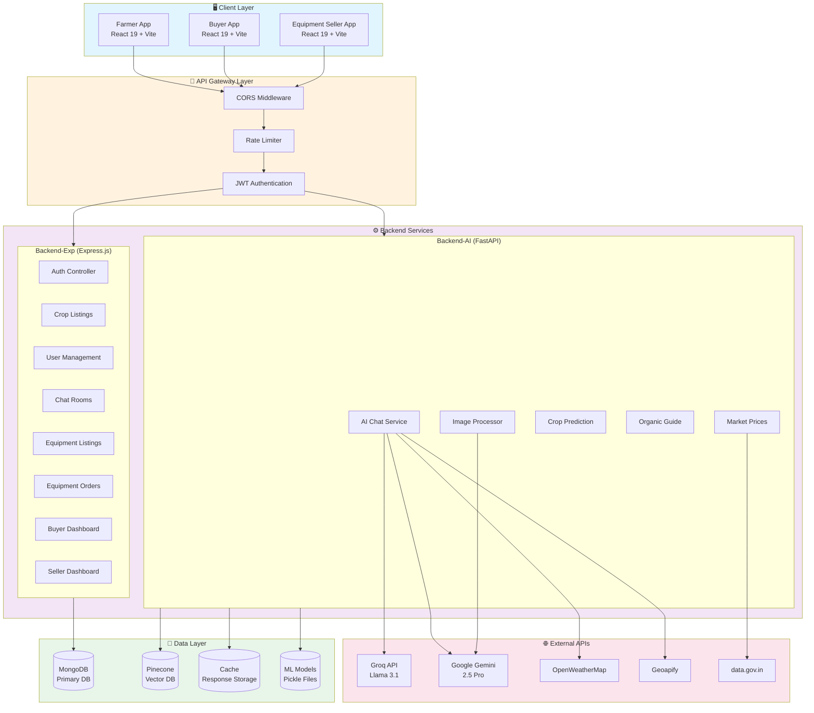
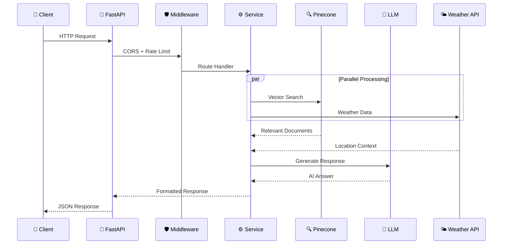
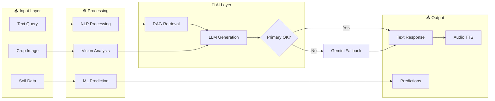

<div align="center">

# 🌾 AGROGYAAN

### *Empowering Farmers Through Intelligent Technology*

[](https://github.com)
[](LICENSE)
[](https://github.com)
[](https://python.org)
[](https://nodejs.org)
[](https://react.dev)
[](https://fastapi.tiangolo.com)
[](https://mongodb.com)

**A comprehensive digital platform revolutionizing agriculture by connecting farmers, buyers, and equipment suppliers through AI-powered insights and data-driven decision making.**

[🚀 Getting Started](#-installation--setup) • [📖 Documentation](#-usage) • [🏗️ Architecture](#-architecture-diagram) • [🤝 Contributing](#-contributing)

</div>

---

## 📋 Table of Contents

- [Project Overview](#-project-overview)
- [Installation & Setup](#-installation--setup)
- [Usage](#-usage)
- [Architecture Diagram](#-architecture-diagram)
- [Feature Comparison](#-feature-comparison)
- [Configuration Options](#-configuration-options)
- [Contributing](#-contributing)
- [License](#-license)
- [Recent Changes (v2.1.0)](#-recent-changes-v210)
- [Future Roadmap](#-future-roadmap)
- [FAQ](#-frequently-asked-questions)
- [Contact](#-contact)

---

## 🌟 Project Overview

### Vision
To empower farmers with smart agricultural solutions, facilitate direct market access, and create a sustainable ecosystem that benefits all stakeholders in the agricultural value chain.

### What is AgroGyaan?
AgroGyaan is an **AI-powered agricultural platform** that bridges the gap between modern technology and traditional farming. It provides:

- 🤖 **AI Chat Assistant** — Natural language conversations with RAG-enhanced responses
- 🔬 **Disease Detection** — Image-based crop disease identification using Gemini Vision
- 📊 **Crop Recommendations** — ML-powered suggestions based on soil and weather data
- 💰 **Market Intelligence** — Real-time commodity prices from government sources
- 🌐 **Multi-language Support** — 12+ regional Indian languages via text-to-speech
- 🛒 **Direct Marketplace** — Connect farmers, buyers, and equipment suppliers
- 🚜 **Equipment Listing & Ordering** — Full equipment management for sellers with order tracking
- 📋 **Dynamic Dashboards** — Real-time buyer and seller dashboards with analytics
- ✏️ **Crop Listing Management** — Create, edit, and manage crop listings with ease

### Key Highlights

| Metric | Value |
|--------|-------|
| 🌍 Languages Supported | 12+ Regional Languages |
| 🤖 AI Models | Groq Llama 3.1 + Google Gemini 2.5 Pro |
| 📚 Knowledge Base | RAG with Pinecone Vector DB |
| ⚡ Response Time | <2s with intelligent caching |
| 🔐 Uptime SLA | 99.9% with model fallback |
| 🚀 Deployment | Vercel (Frontend) + Render (Backend) |

---

## 🛠️ Installation & Setup

### Prerequisites

Ensure you have the following installed:

| Requirement | Version | Purpose |
|-------------|---------|---------|
| Node.js | v20.x or higher | Frontend & Express backend |
| Python | 3.8+ | AI/ML services |
| MongoDB | 6.0+ | Primary database |
| npm | 10.x+ | Package management |
| Git | Latest | Version control |

### Clone the Repository

```bash
git clone https://github.com/your-username/AgroGyaan.git
cd AgroGyaan
```

### Environment Configuration

Create `.env` files in each backend directory with the required environment variables:

**Backend-AI/.env**
```env
GROQ_API_KEY=your_groq_api_key
GOOGLE_API_KEY=your_google_gemini_api_key
PINECONE_API_KEY=your_pinecone_api_key
PINECONE_ENV=your_pinecone_environment
OPENWEATHERMAP_API_KEY=your_weather_api_key
GEOAPIFY_API_KEY=your_geoapify_api_key
DATA_GOV_API_KEY=your_data_gov_api_key
```

**Backend-Exp/.env**
```env
MONGODB_URI=mongodb://localhost:27017/agrogyaan
JWT_SECRET=your_jwt_secret_key
PORT=5000
```

### Quick Start — All Services

```bash
# Terminal 1: AI Backend (FastAPI)
cd Backend-AI
pip install -r requirements.txt
uvicorn main:app --reload --host 0.0.0.0 --port 8000
# ✅ Runs on http://localhost:8000

# Terminal 2: Express Backend
cd Backend-Exp
npm install
npm start
# ✅ Runs on http://localhost:5000

# Terminal 3: Farmer Frontend
cd Farmer
npm install
npm run dev
# ✅ Runs on http://localhost:5173

# Terminal 4: Buyer Frontend
cd Buyer
npm install
npm run dev
# ✅ Runs on http://localhost:5174

# Terminal 5: Equipment Seller Frontend
cd Equip-Seller
npm install
npm run dev
# ✅ Runs on http://localhost:5175
```

### Verify Installation

```bash
# Check AI Backend Health
curl http://localhost:8000/health

# Expected Response:
# {"status": "healthy", "service": "AI Farming Assistant API", "version": "2.0.0"}
```

---

## 📖 Usage

### Example Workflows

#### 1. AI Chat Assistant Query

```bash
curl -X POST http://localhost:8000/api/chat \
  -H "Content-Type: application/json" \
  -d '{
    "query": "What crops should I plant in winter season?",
    "user_location": {
      "latitude": 28.6139,
      "longitude": 77.2090,
      "city": "Delhi",
      "state": "Delhi"
    }
  }'
```

**Response:**
```json
{
  "query": "What crops should I plant in winter season?",
  "answer": "For winter season (Rabi), consider planting wheat, barley, mustard, peas, and chickpeas...",
  "llm_source": "Groq (Llama 3.1)",
  "season": {
    "current_season": "Winter (Rabi Season)",
    "description": "Cold and dry season, suitable for wheat, barley, peas, and mustard"
  },
  "crop_suggestions": ["Wheat", "Barley", "Mustard", "Peas", "Chickpeas"]
}
```

#### 2. Crop Recommendation with ML

```bash
curl -X POST http://localhost:8000/api/predict \
  -H "Content-Type: application/json" \
  -d '{
    "N": 90,
    "P": 42,
    "K": 43,
    "temperature": 20.88,
    "humidity": 82.0,
    "ph": 6.5,
    "rainfall": 202.94
  }'
```

**Response:**
```json
{
  "predicted_crop": "rice",
  "confidence": 0.92,
  "recommendations": [
    {"crop": "rice", "confidence": 0.92, "suitability": "SUITABLE"},
    {"crop": "maize", "confidence": 0.65, "suitability": "SUITABLE"}
  ]
}
```

#### 3. Image-Based Disease Detection

```bash
curl -X POST http://localhost:8000/api/chat-with-image \
  -F "query=What disease does this plant have?" \
  -F "image=@crop_image.jpg"
```

### User Roles

```
┌───────────────────────────────────────────────────────────────────┐
│                        AGROGYAAN USERS                            │
├──────────────────┬──────────────────────┬─────────────────────────┤
│    🌱 FARMER     │     🛒 BUYER        │   🚜 EQUIPMENT SELLER  │
├──────────────────┼──────────────────────┼─────────────────────────┤
│ • Crop Planning  │ • Browse Listings    │ • Add/Edit Equipment    │
│ • AI Chat        │ • Direct Purchase    │ • View Equipment List   │
│ • Disease Detect │ • Dynamic Dashboard  │ • Order Management      │
│ • Weather Check  │ • Price Comparison   │ • Seller Dashboard      │
│ • Price Tracker  │ • Farmer Chat        │ • Customer Chat         │
│ • Organic Guide  │ • Order Management   │ • Notifications         │
│ • Edit Listings  │ • Marketplace Search │ • Seller Profile        │
│ • My Listings    │ • Cart Management    │ • Market Insights       │
│ • My Orders      │ • Notifications      │ • Dashboard Overview    │
└──────────────────┴──────────────────────┴─────────────────────────┘
```

---

## 🏗️ Architecture Diagram

### High-Level System Architecture



### Request Flow Sequence



### Data Flow Architecture



---

## ⚖️ Feature Comparison

### Platform Support Matrix

| Feature | Farmer App | Buyer App | Equipment Seller |
|---------|:----------:|:---------:|:----------------:|
| AI Chat Assistant | ✅ | ❌ | ❌ |
| Disease Detection | ✅ | ❌ | ❌ |
| Crop Recommendation | ✅ | ❌ | ❌ |
| Weather Tracking | ✅ | ✅ | ❌ |
| Market Prices | ✅ | ✅ | ❌ |
| Product Listings | ✅ | ✅ | ✅ |
| Direct Messaging | ✅ | ✅ | ✅ |
| Order Management | ✅ | ✅ | ✅ |
| Organic Farming Guide | ✅ | ❌ | ❌ |
| Equipment Catalog | ❌ | ✅ | ✅ |
| Multi-language TTS | ✅ | ❌ | ❌ |
| Dynamic Dashboard | ❌ | ✅ | ✅ |
| Crop Listing Edit | ✅ | ❌ | ❌ |
| Equipment Ordering | ❌ | ✅ | ✅ |
| Cart Management | ❌ | ✅ | ❌ |
| Seller Dashboard | ❌ | ❌ | ✅ |

### Technology Stack Comparison

| Layer | Technology | Version | Purpose |
|-------|------------|---------|---------|
| **Frontend** | React | 19.1.1 | UI Framework |
| **Build Tool** | Vite | 7.1.2 | Fast bundling |
| **Styling** | Tailwind CSS | 3.4.17 | Utility-first CSS |
| **Components** | shadcn/ui | Latest | UI component library |
| **State** | TanStack Query | 5.87+ | Server state management |
| **Express Backend** | Express.js | 5.1.0 | REST API server |
| **AI Backend** | FastAPI | 0.110.0 | Async Python API |
| **Primary DB** | MongoDB | 6.19+ | Document storage |
| **Vector DB** | Pinecone | Cloud | Semantic search |
| **Primary LLM** | Groq | Llama 3.1-8b | Fast inference |
| **Fallback LLM** | Google Gemini | 2.5 Pro | Complex queries |

---

## ⚙️ Configuration Options

### AI Backend Configuration

| Variable | Type | Default | Description |
|----------|------|---------|-------------|
| `GROQ_API_KEY` | string | Required | Groq API authentication key |
| `GOOGLE_API_KEY` | string | Required | Google Gemini API key |
| `PINECONE_API_KEY` | string | Required | Pinecone vector DB key |
| `PINECONE_ENV` | string | Required | Pinecone environment |
| `CACHE_TTL` | integer | `86400` | Cache time-to-live (seconds) |
| `MAX_IMAGE_SIZE` | integer | `5242880` | Max image upload size (5MB) |
| `SIMILARITY_THRESHOLD` | float | `0.5` | Vector similarity threshold |
| `CHUNK_SIZE` | integer | `1000` | Document chunk size (chars) |
| `CHUNK_OVERLAP` | integer | `200` | Chunk overlap (chars) |

### Express Backend Configuration

| Variable | Type | Default | Description |
|----------|------|---------|-------------|
| `MONGODB_URI` | string | Required | MongoDB connection string |
| `JWT_SECRET` | string | Required | Secret for JWT signing |
| `JWT_EXPIRY` | string | `7d` | Token expiration time |
| `PORT` | integer | `5000` | Server port |
| `CORS_ORIGIN` | string | `*` | Allowed CORS origins |

### Rate Limiting Configuration

| API | Requests/Minute | Burst Limit |
|-----|-----------------|-------------|
| Groq LLM | 100 | 150 |
| Google Gemini | 60 | 80 |
| Weather API | 60 | 100 |
| Market Price | 120 | 200 |
| Chat Endpoint | 100 | 150 |

---

## 🤝 Contributing

We welcome contributions from the community! Here's how you can help:

### Getting Started

1. **Fork the repository**
2. **Clone your fork**
   ```bash
   git clone https://github.com/your-username/AgroGyaan.git
   ```
3. **Create a feature branch**
   ```bash
   git checkout -b feature/amazing-feature
   ```
4. **Make your changes**
5. **Commit with conventional commits**
   ```bash
   git commit -m "feat: add amazing feature"
   ```
6. **Push and create a Pull Request**
   ```bash
   git push origin feature/amazing-feature
   ```

### Coding Standards

| Area | Standard |
|------|----------|
| **JavaScript/React** | ESLint with React Hooks plugin |
| **Python** | PEP 8, Black formatter |
| **Commits** | [Conventional Commits](https://conventionalcommits.org) |
| **Documentation** | JSDoc for JS, Docstrings for Python |
| **Testing** | Unit tests for all new features |

### Commit Message Format

```
<type>(<scope>): <subject>

Types: feat, fix, docs, style, refactor, test, chore
Example: feat(chat): add voice input support
```

### Issue Reporting

When reporting issues, please include:
- **Environment details** (OS, Node/Python version)
- **Steps to reproduce**
- **Expected vs actual behavior**
- **Screenshots/logs if applicable**

---

## 📄 License

This project is licensed under the **MIT License**.

```
MIT License

Copyright (c) 2026 AgroGyaan Team
```

---

## 📝 Recent Changes (v2.1.0)

### 🚜 Equipment Seller Module
- **Equipment Listing Management** — Add, view, and manage equipment listings with full CRUD operations
- **Order Management** — Track and process equipment orders with status updates
- **Seller Dashboard** — Real-time dashboard with analytics and overview metrics
- **API Service Layer** — Dedicated `api.js` service for all equipment seller API calls

### 🛒 Buyer Module
- **Dynamic Dashboard** — Fully dynamic `DashboardOverview` and `DashboardLayout` with real-time data
- **Enhanced Marketplace** — Improved search, filtering, and browsing experience
- **Order Tracking** — View and manage orders with real-time status updates

### 🌱 Farmer Module
- **Crop Listing Editing** — Edit existing crop listings via updated `AddCropModal`
- **My Listings Management** — Enhanced listing management with edit/delete capabilities
- **URL & Service Updates** — Updated API endpoints and service configurations

### ⚙️ Backend-Exp (Express.js)
- **Equipment Listing Routes & Controller** — Full REST API for equipment CRUD (`/api/equipment-listings`)
- **Equipment Order Routes & Controller** — Order management API (`/api/equipment-orders`)
- **Buyer Dashboard Controller** — Dashboard analytics and stats API (`/api/dashboard`)
- **Seller Dashboard Controller** — Seller-specific dashboard metrics (`/api/seller-dashboard`)
- **Crop Listing Edit** — Added edit functionality to crop listing routes
- **Bug Fixes** — Fixed order routes and connection handling (port reset to 5000)

### 🚀 Deployment
- **Vercel Configuration** — Added `vercel.json` for Buyer, Equipment Seller, and updated Farmer app
- **SPA Routing** — Configured rewrites for client-side routing in production

---

## 🔮 Future Roadmap

### Q1 2026
- [ ] 🌐 **Offline Mode** — PWA support for areas with limited connectivity
- [ ] 📱 **Mobile Apps** — Native iOS and Android applications
- [ ] 🗣️ **Voice Interface** — Complete voice-based navigation and queries

### Q2 2026
- [ ] 🛰️ **Satellite Integration** — Crop monitoring via satellite imagery
- [ ] 🤝 **Government Portal Integration** — Direct subsidy and scheme information
- [ ] 📊 **Advanced Analytics Dashboard** — Comprehensive farming insights

### Q3 2026
- [ ] 🌾 **IoT Sensor Support** — Integration with soil and weather sensors
- [ ] 🚜 **Smart Equipment Integration** — Connected farm machinery support
- [ ] 💳 **Digital Payments** — In-app payment processing

### Q4 2026
- [ ] 🤖 **Fine-tuned Agricultural LLM** — Custom model trained on Indian agricultural data
- [ ] 🌍 **Regional Expansion** — Support for Southeast Asian markets
- [ ] 📈 **Predictive Market Analysis** — AI-powered price forecasting

---

## ❓ Frequently Asked Questions

### General Questions

<details>
<summary><strong>Q1: What makes AgroGyaan different from other agricultural platforms?</strong></summary>

AgroGyaan combines **AI-powered insights** with **local context awareness**. Our platform:
- Uses RAG (Retrieval Augmented Generation) for accurate, document-backed responses
- Provides location-aware recommendations based on real-time weather
- Supports 12+ regional Indian languages with text-to-speech
- Offers image-based disease detection using state-of-the-art vision models
- Connects all stakeholders (farmers, buyers, equipment sellers) in one ecosystem

</details>

<details>
<summary><strong>Q2: Is AgroGyaan available offline?</strong></summary>

Currently, AgroGyaan requires an internet connection for full functionality. However, we are developing a **Progressive Web App (PWA)** version that will allow:
- Cached responses for previously asked questions
- Offline access to organic farming guides
- Background sync when connectivity is restored

This feature is planned for Q1 2026.

</details>

<details>
<summary><strong>Q3: Which languages are supported for text-to-speech?</strong></summary>

AgroGyaan supports **12+ languages** for audio responses:

| Language | Code | Language | Code |
|----------|------|----------|------|
| English | `en` | Bengali | `bn` |
| Hindi | `hi` | Tamil | `ta` |
| Telugu | `te` | Marathi | `mr` |
| Gujarati | `gu` | Kannada | `kn` |
| Malayalam | `ml` | Punjabi | `pa` |
| Spanish | `es` | French | `fr` |

</details>

### Technical Questions

<details>
<summary><strong>Q4: How accurate is the crop disease detection?</strong></summary>

Our disease detection system uses **Google Gemini Vision API** and achieves:
- **85-92% accuracy** on common crop diseases
- Best results with clear, well-lit images
- Supports major crops: rice, wheat, maize, cotton, tomatoes, etc.

For best results:
1. Take photos in natural daylight
2. Focus on affected plant parts
3. Include both healthy and affected areas for comparison

</details>

<details>
<summary><strong>Q5: What happens if the primary AI model fails?</strong></summary>

AgroGyaan implements **automatic failover**:
1. Primary: **Groq (Llama 3.1-8b-instant)** — Fast responses
2. Fallback: **Google Gemini 2.5 Pro** — Complex queries

This ensures **99.9% availability**. The system seamlessly switches between models without user intervention.

</details>

<details>
<summary><strong>Q6: How is my data protected?</strong></summary>

We implement multiple security layers:
- **JWT Authentication** — Secure token-based access
- **Input Validation** — Pydantic models for all requests
- **Rate Limiting** — Protection against abuse
- **CORS Configuration** — Controlled cross-origin access
- **Image Validation** — Format and size verification
- **Helmet Security** — HTTP security headers

All data is stored in encrypted MongoDB databases. We do not share user data with third parties.

</details>

---

## 📞 Contact

<div align="center">

| Channel | Link |
|---------|------|
| 🐙 **GitHub** | [AgroGyaan Repository](https://github.com/agrogyaan) |

</div>

### Production Deployments

| Service | URL | Platform |
|---------|-----|----------|
| **AI Backend** | https://agrogyaan-b-ai.onrender.com | Render |
| **Express Backend** | https://backend-exp-yul4.onrender.com | Render |
| **Farmer App** | https://agro-gyaan-xi.vercel.app/ | Vercel |
| **Buyer App** | https://agrogyaan-buyer.vercel.app/ | Vercel |
| **Equipment Seller App** | https://agrogyaan-seller.vercel.app/ | Vercel |

---

<div align="center">

**Made with ❤️ for Indian Farmers**

🌾 *Empowering Agriculture Through Technology* 🌾

[](https://github.com/agrogyaan/agrogyaan)

</div>